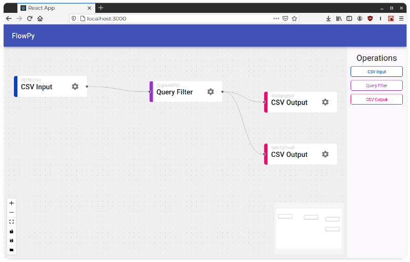
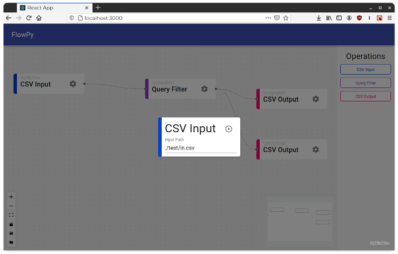
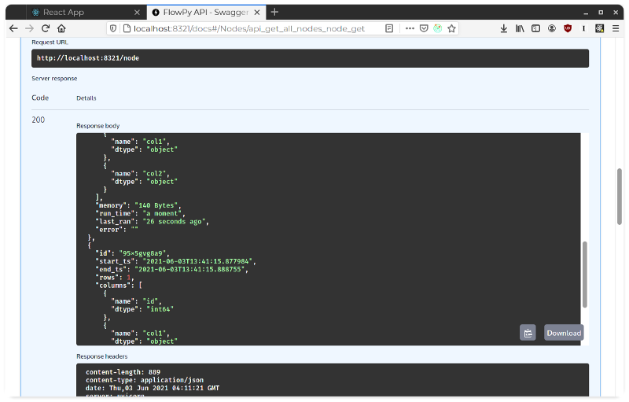

# FlowPy

A python application for manipulating pandas data frames from the comfort of your web browser. Data flows are represented as a Directed Acyclic Graph, and nodes can be ran individually as the user sees fit.

Currently there are two components to this application, they are: 
* flowpyapi - the python backend 
* flowpystudio - the react web front end







Technically the react front end can be built and expressed via FastAPI's static funcitonality, but right now in pre alpha they are just run from seperate terminals to keep development as smooth as possible.

# Usage

```bash
python -m venv venv
source ./venv/bin/activate

pip install -r requirements.txt

python -m flowpyapi

# in another terminal window:
cd flowpystudio
yarn start
```

# Author

- Patrick Coffey (schlerp)
